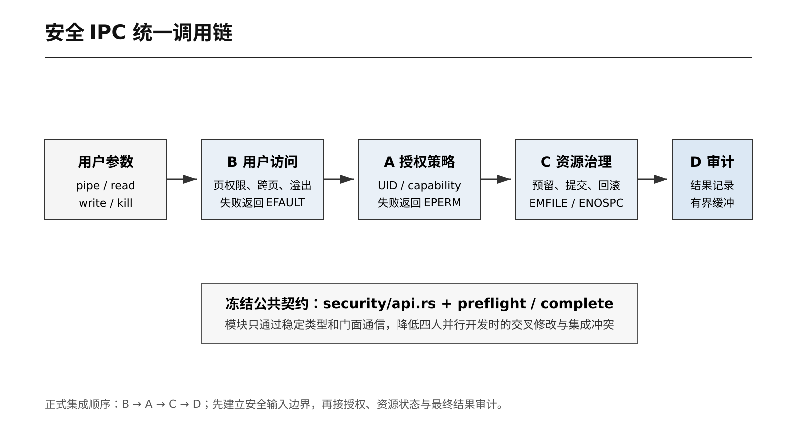
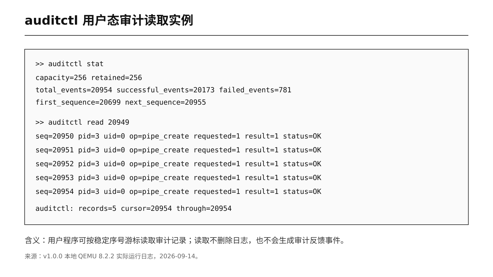
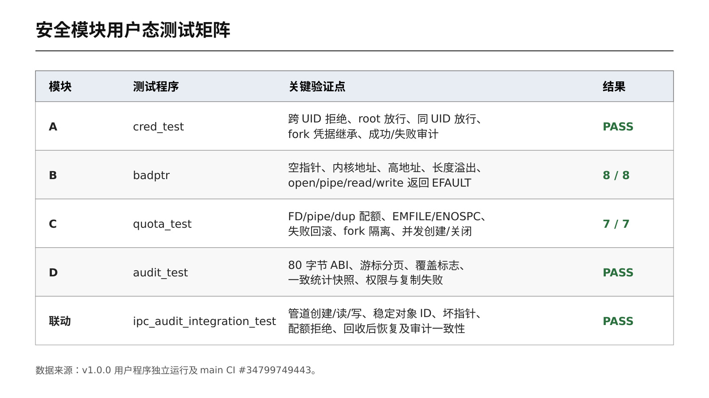
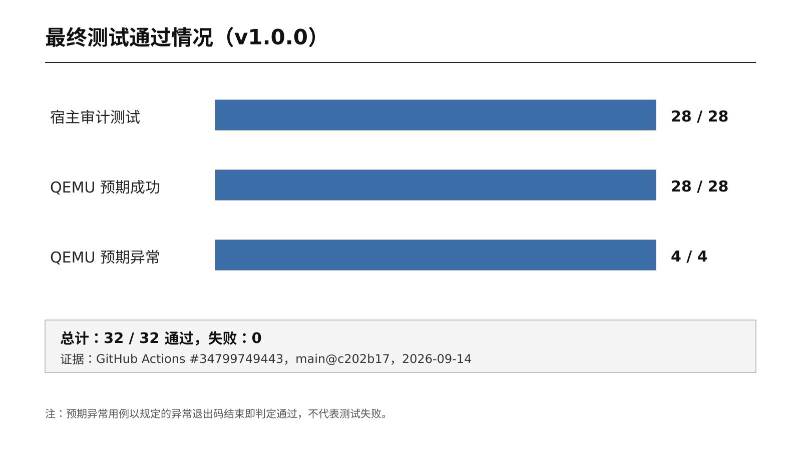
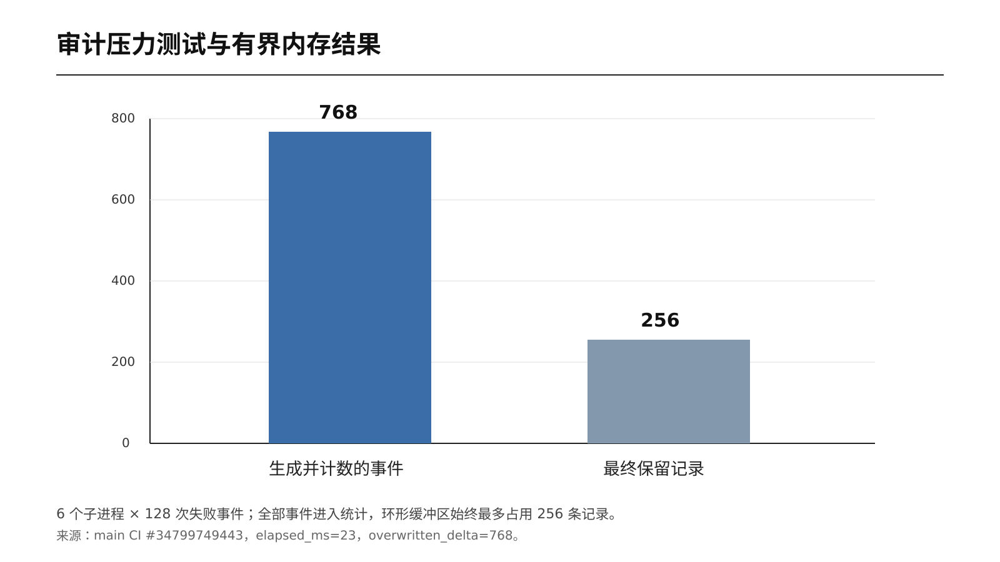
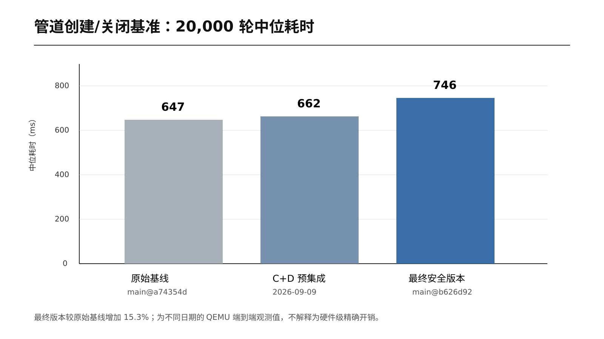

# 基于 rCore 的安全进程间通信机制设计与实现

> 课程设计报告完整草稿。请复制到学校统一 Word 模板，并替换所有 `[待填写]` 项。
> 正文事实以 `v1.0.0` 为准；排版时建议正文小四、1.5 倍行距，代码使用等宽字体。

## 封面信息

| 项目 | 内容 |
| --- | --- |
| 课程名称 | `[待填写]` |
| 设计题目 | 基于 rCore 的安全进程间通信机制设计与实现 |
| 学院/专业 | `[待填写]` |
| 班级 | `[待填写]` |
| 组员 A | `[姓名/学号：凭据与授权]` |
| 组员 B | `[姓名/学号：用户地址安全]` |
| 组员 C | `[姓名/学号：IPC 资源治理]` |
| 组员 D | `[姓名/学号：审计、测试与集成]` |
| 指导教师 | `[待填写]` |
| 完成日期 | 2026 年 9 月 |

## 摘要

进程间通信（Inter-Process Communication，IPC）是操作系统支持协作计算和资源共享的基础。
rCore-Tutorial-v3 第七章教学内核已经提供管道、文件描述符和信号等机制，但其主要目标是
说明功能原理，对调用者身份、用户地址边界、资源耗尽和安全审计的覆盖较少。若系统调用直接
信任用户指针、允许任意进程发送信号、缺少每进程资源上限或持续无界记录日志，恶意或错误
程序可能导致内核崩溃、越权控制、资源耗尽或事后不可追踪。

本项目在 rCore 第七章内核基础上设计并实现一套最小、模块化、可测试的安全 IPC 扩展。
系统增加 UID 与能力位组成的进程凭据，对信号发送实施自进程、同 UID、root 和 `KILL`
能力授权；建立统一用户内存复制接口，对地址回绕、未映射页、用户位和读写权限逐页检查，
将错误稳定映射为 `EFAULT`；为文件描述符和管道端点设置每进程配额，以预留—执行—提交/
回滚模型保证失败路径不泄漏计数；实现容量固定为 256 条的审计环形缓冲区、80 字节稳定
ABI、非破坏性游标读取、统计查询和 `auditctl` 用户工具。四个模块通过冻结的公共 API 和
`preflight/complete` 门面集成，依照 B→A→C→D 的依赖顺序完成联合验证。

最终版本在宿主侧通过 28 项审计测试，在 QEMU 中通过 28 个预期成功和 4 个预期异常用例，
共 32/32。六个子进程并发产生的 768 条审计事件全部进入统计，内核仅保留最新 256 条，
证明内存占用有确定上限。20,000 轮管道创建/关闭基准的最终中位耗时为 746 ms，相对原始
基线 647 ms 增加约 15.3%，未观察到数量级性能回退。结果表明，在保持教学内核结构清晰和
测试可复现的前提下，可以通过最小凭据、边界复制、事务式配额和有界审计显著增强 IPC 的
机密性边界、完整性、可用性与可追责性。

**关键词：** rCore；Rust；进程间通信；访问控制；用户指针；资源配额；安全审计

## Abstract

Inter-process communication (IPC) is essential for process coordination and resource sharing.
The chapter-7 kernel of rCore-Tutorial-v3 provides pipes, file descriptors, and signals for
educational purposes, but offers limited protection against unauthorized signaling, invalid user
pointers, per-process resource exhaustion, and missing audit trails. This project designs and
implements a minimal and modular secure IPC extension for rCore. It introduces UID- and
capability-based credentials, signal authorization, page-aware user-memory copying, transactional
file-descriptor and pipe quotas, and a bounded audit subsystem with a stable 80-byte ABI and a
user-space `auditctl` utility. The four modules are integrated through a frozen security facade in
the order B→A→C→D. The final version passes 28/28 host-side tests and 32/32 QEMU user tests. A
six-process stress test accounts for all 768 generated events while retaining at most 256 records.
A 20,000-iteration pipe benchmark shows a median of 746 ms versus a 647 ms baseline, an observed
increase of approximately 15.3% without an order-of-magnitude regression. The results demonstrate
that explicit security boundaries can be added to a teaching kernel while retaining modularity,
bounded memory usage, and reproducible validation.

**Keywords:** rCore; Rust; IPC; access control; user pointer; resource quota; security audit

---

## 1 绪论

### 1.1 项目背景

操作系统内核处在进程、硬件和资源之间，是系统安全边界的最终执行者。用户程序之间需要
交换数据、同步状态或控制任务，因此操作系统通常提供管道、信号、共享内存、消息队列和
套接字等 IPC 机制。IPC 提升了系统的组合能力，也把多个原本隔离的主体连接起来：一个进程
可以向另一个进程发送控制信息，可以通过文件描述符读写内核对象，也可以请求内核复制用户
内存。这些路径一旦缺少身份、边界和资源检查，就可能成为越权和拒绝服务入口。

rCore-Tutorial-v3 是使用 Rust 实现的 RISC-V 教学操作系统。第七章已经具备进程、虚拟内存、
文件系统、管道和信号等功能，适合作为 IPC 安全实验基线。教学实现优先展示机制，通常不会
同时实现完整 POSIX 凭据、系统级审计框架或生产环境配额。本项目不改变其教学定位，而是在
原有代码上补充一条结构清晰、可解释和可验证的最小安全路径。

### 1.2 研究问题

项目围绕四个具体问题展开：

1. **谁可以执行 IPC 操作？** 原始信号路径需要引入进程身份和授权策略。
2. **内核如何安全访问用户提供的地址？** Rust 不能自动证明来自系统调用寄存器的裸地址合法。
3. **单个进程最多能占用多少 IPC 资源？** 管道和 FD 必须有上限，失败路径还要正确回滚。
4. **系统如何记录安全结果？** 日志要包含主体、对象、操作、结果和时间，同时自身不能无界增长。

### 1.3 项目目标

- 建立 UID 与能力位组成的最小凭据模型。
- 对信号发送实施可解释的授权规则，并返回稳定错误码。
- 对 IPC 相关用户地址执行范围、映射、页权限和跨页检查。
- 对文件描述符和管道端点实施每进程配额和生命周期治理。
- 为信号、管道创建、管道读写和审计控制操作生成统一记录。
- 提供用户态攻击、边界、并发、压力与性能测试，并接入持续集成。
- 使用冻结公共 API 控制四人并行开发的依赖和冲突。

### 1.4 项目范围

本项目面向教学内核，不实现完整 POSIX 用户数据库、SELinux、网络 IPC、通用消息加密和
跨机器分布式审计。目标不是把 rCore 变为生产内核，而是验证安全设计原则在小型内核中的
组合方式，并形成可重复的课程实验。

## 2 rCore 与 IPC 基础

### 2.1 rCore 项目特点

rCore 使用 Rust 实现操作系统核心逻辑，以所有权、借用和类型系统降低部分内存安全风险；
以 RISC-V 为主要实验平台，结构相对紧凑；各章节逐步加入地址空间、进程、文件系统、IPC
和并发机制，便于定位代码与实验验证。Rust 能减少悬垂引用和数据竞争等问题，但系统调用参数
本质上仍是来自不可信用户态的整数和裸地址，内核必须显式检查页表、权限和长度。

### 2.2 IPC 的含义

IPC 是不同进程之间交换数据或控制信息的机制。在本项目基线中，主要对象为：

- **管道**：内核维护字节缓冲区，进程通过读写端文件描述符传输数据；
- **信号**：一个进程向目标进程发送异步控制通知；
- **文件描述符**：用户进程引用文件或管道对象的整数句柄，也是资源治理的入口。

### 2.3 rCore 第七章中的作用

第七章将文件系统、进程和同步机制连接起来。管道展示内核对象在不同进程间共享，信号展示
异步控制与异常处理，fork/exec/close/dup 展示句柄的复制和生命周期。由于这些机制跨越进程
隔离边界，它们也是最适合开展授权、边界检查、资源限制和审计实验的位置。

## 3 需求分析与威胁模型

### 3.1 安全需求

| 编号 | 需求 | 验收标准 |
| --- | --- | --- |
| R1 | 信号授权 | 跨 UID 普通进程被拒绝，同 UID/root 被允许 |
| R2 | 用户地址安全 | 空、内核、高地址、回绕和跨页非法范围返回 EFAULT，内核不 panic |
| R3 | 资源可用性 | FD/pipe 超限只影响调用进程，关闭后恢复，失败不泄漏计数 |
| R4 | 审计完整性 | 成功和失败均记录主体、对象、请求量、结果和 errno |
| R5 | 审计有界性 | 固定容量，覆盖行为和缺口可观察，不无限分配内存 |
| R6 | ABI 稳定性 | 用户和内核共享固定宽度结构、编号和错误约定 |
| R7 | 可回归性 | 宿主快速测试与 QEMU 真实路径测试均可自动执行 |

### 3.2 攻击面

1. 普通进程向不同身份目标发送 SIGKILL，造成越权终止。
2. 将 null、内核地址、未映射地址或溢出范围传给 read/write/open/pipe。
3. 跨页对象部分有效、部分无效，诱导内核发生部分复制或物理不连续误用。
4. 循环创建管道、打开或复制 FD，耗尽内核资源。
5. 在资源预留后让用户复制失败，诱导配额计数永久增加。
6. 高频制造审计事件，使日志系统自身耗尽内存。
7. 用非法游标、超大容量、未知操作或部分复制破坏审计消费者状态。

### 3.3 信任边界

内核代码和已验证的内核状态属于可信计算基；所有系统调用号、整数参数、用户地址、长度、
标志和进程行为均不可信。用户态工具只负责展示，不参与最终授权决定。宿主测试中的任务和
复制替身仅用于验证算法，不能代表真实 RISC-V 页表与调度，因此必须由 QEMU 测试补足。

## 4 总体设计

### 4.1 模块划分

| 模块 | 核心文件 | 输入 | 输出/效果 |
| --- | --- | --- | --- |
| A 凭据授权 | `credentials.rs`、`policy.rs` | 主体/对象身份、操作 | 允许或 PermissionDenied |
| B 用户访问 | `user_access.rs`、`page_table.rs` | token、裸地址、长度、方向 | 安全复制或 InvalidAddress |
| C 资源治理 | `quota.rs`、`fs.rs` | 进程配额、申请数量 | 预留、提交或回滚 |
| D 安全审计 | `audit.rs`、`security.rs` | 请求与最终结果 | 有界记录、统计与用户查询 |



**图 4-1 安全 IPC 统一调用链**

### 4.2 冻结公共 API

四人开发最容易冲突的位置是任务控制块、系统调用表、错误码和跨模块类型。如果每个分支都
直接依赖其他模块的内部结构，一个字段改名就会同时破坏多个分支，集成时也无法区分接口问题
和实现问题。因此项目在正式并行前冻结 `security/api.rs`：

- `Uid=u32`、`ResourceId=u64`；
- `CapabilitySet` 包含 KILL、IPC_ADMIN、AUDIT_READ；
- `IpcSubject`、`IpcObject`、`IpcRequest` 描述公共请求；
- `IpcOperation` 固定操作类别；
- `IpcError` 统一映射到用户可见 errno；
- 系统调用 600～603 的编号和 ABI 固定。

冻结并不意味着接口永不演进，而是要求变更通过单独评审，确保代码、用户库、测试和文档
同时更新。其直接收益是各成员可以使用稳定契约并行实现，编译错误更接近真实模块缺陷，集成
冲突集中在少量门面提交中。

### 4.3 `preflight/complete` 事务式门面

一次安全 IPC 操作分为：

```text
用户地址检查 → 构造请求 → preflight 授权/配额预留
→ 执行真实 IPC → complete 提交或回滚 → 写入最终审计 → errno 返回
```

`preflight` 只在真实操作前做可决定的检查；`complete` 必须看到真实返回结果，才能正确保留
或回滚配额并记录实际字节数。如果预检查失败，系统直接记录一次失败事件；如果预检查成功，
由完成阶段记录一次，避免同一操作重复审计。

### 4.4 正式集成顺序

采用 B→A→C→D：

1. B 先建立不可信输入边界，否则后续模块读取的 UID、FD 数组或审计输出地址都可能不安全。
2. A 使用已验证参数做身份和授权判断，决定操作能否继续。
3. C 只为获准操作预留资源，并依赖最终结果回滚。
4. D 最后观察统一请求和实际结果，形成完整审计。

这既是 Git 分支依赖顺序，也是一次系统调用内部的逻辑顺序。

## 5 详细设计与实现

### 5.1 进程凭据与信号授权

`Credentials` 包含 `uid` 和 `CapabilitySet`。initproc 使用 UID 0 和全部能力；fork 复制父进程
凭据；普通进程通过受限 setuid 接口只降权，不能自行恢复 root。信号目标以 PID 作为稳定对象
标识，并附带目标 UID。

授权规则按顺序为：自发送允许、同 UID 允许、root 允许、持有 KILL 能力允许，其他返回
`PermissionDenied` 并映射 `EPERM`。检查必须在改变目标进程状态前完成。系统调用仍区分
目标不存在的 ESRCH 和目标存在但无权操作的 EPERM。

`cred_test` 同时验证跨 UID 拒绝、root 覆盖、同 UID 放行、fork 继承和审计记录，避免只测试
策略纯函数而遗漏真实 kill 路径。

### 5.2 用户地址与复制安全

系统调用入口获得的是 `usize` 地址，不是经过 Rust 借用检查的引用。实现先使用
`checked_add` 防止 `start+len` 回绕，再逐页查找页表项，检查用户位和访问方向对应的 R/W
权限。跨页范围被拆为多个页内切片，复制函数按顺序拼接，不假定物理连续。

- `copy_from_user<T: Copy>`：把用户结构复制到内核独立值；
- `copy_to_user<T: Copy>`：把内核值复制到已验证可写的用户范围；
- `copy_bytes_from_user`：验证可读字节范围并形成分段 UserBuffer；
- 字符串和 argv 路径限制终止条件，避免无 NUL 时无限扫描。

验证或复制失败返回 `InvalidAddress→EFAULT`。先验证完整范围再产生外部可见效果，避免一半数据
已经写入后才发现后一页无效。`badptr` 直接使用原始系统调用构造 8 类恶意地址；跨页非对齐
80 字节审计输出则验证合法跨页复制。

### 5.3 IPC 资源治理

每个进程最多打开 32 个 FD，其中最多 16 个管道端点。一个 pipe 创建两个端点，因此必须在
安装任一 FD 前原子检查两类上限。`QuotaState` 保存 `open_files`、`open_pipes` 和管道 FD
位图；close 根据位图同时释放普通 FD 与管道端点计数，dup 根据源 FD 类型收费，fork 复制
父进程当时的使用快照。

资源操作采用事务模型。preflight 成功后返回不透明 reservation；真实 pipe 与用户 FD 数组
复制全部成功时保留计数，任何后续错误则 complete 精确释放本次预留。这样即使输出地址是
坏指针，也不会出现“管道未交付给用户、配额却永久减少”的问题。

普通 FD 达到上限返回 EMFILE；管道端点达到专用上限返回 ENOSPC。`quota_test` 覆盖 open、
dup、pipe、回滚、恢复、fork 隔离和父子并发创建/关闭。

### 5.4 有界安全审计

审计模块使用固定容量 256 的环形缓冲区。每条记录包含 ABI 版本、记录大小、操作、标志、
errno、主体 PID/UID、对象 ID/所有者、序号、时间、请求量和实际结果。内核内部枚举不会直接
暴露到用户态；`AuditRecordV1` 与 `IpcStatsV1` 均固定为 80 字节，并保留字段用于兼容演进。

操作编号包括 signal_send、pipe_create、pipe_read、pipe_write、audit_read 和 ipc_stat。
错误在内核记录为正 errno，系统调用返回负 errno。记录满时覆盖最旧项，同时增加总数和覆盖
计数；下一次读取若跨过已覆盖区间，首条带 `GAP_BEFORE`。

系统调用 602 `audit_read` 使用调用者提供的 `after_sequence` 非破坏性读取，每批最多 32 条；
603 `ipc_stat` 返回一致统计快照。root 或 AUDIT_READ 能力可以读取。成功查询不记录自身，
防止反馈循环；拒绝、非法参数和复制失败仍记录一次控制失败。

用户工具 `auditctl stat` 显示容量、保留量、成功/失败和序号范围；`auditctl read` 固定启动时
的尾部并分页读取，避免新事件持续产生时命令永不结束。



**图 5-1 auditctl 用户态审计读取实例**

## 6 四人协作与集成过程

### 6.1 分工

- A：凭据、信号授权与权限矩阵；
- B：用户地址、页表检查和攻击测试；
- C：FD/管道配额、失败回滚与性能；
- D：审计 ABI、用户工具、压力测试、CI 和集成证据。

### 6.2 分支策略

功能分支从同一 integration 基线创建，通过冻结接口并行开发。功能 PR 先面向 integration；
联合 CI、攻击测试、压力与性能验收后，再由最终 PR 合入 main。main 只保存可交付稳定版本，
不在共享分支使用普通 force push。

### 6.3 关键集成问题

- B 原始封装不足以保证跨页和写权限，正式集成补齐逐页安全复制。
- A 的信号路径需统一进入 preflight/complete，才能同时授权和审计。
- C 的 pipe 请求量按“一次创建”记 1，但内部配额按两个端点收费。
- pipe read/write 需要稳定资源 ID，不能用容易复用的 FD 作为长期对象标识。
- 审计输出可能跨页且非对齐，D 必须依赖 B 的安全复制而非直接解引用。
- 用户测试必须传播真实退出码，不能以打印 PASS 代替自动判定。

## 7 测试设计与结果

### 7.1 测试分层

| 层次 | 目的 | 局限 |
| --- | --- | --- |
| 宿主测试 | 快速验证 ABI、环形算法、游标和系统调用控制流程 | 任务与用户复制使用替身 |
| QEMU 自动测试 | 验证真实 RV64 内核、页表、系统调用、进程和文件系统 | 仿真性能受宿主影响 |
| 独立安全程序 | 生成易截图、易解释的专项结果 | 不能单独替代完整回归 |
| 压力测试 | 验证并发写、覆盖、序号和内存上限 | 单核调度不等于多核竞争 |
| 性能基准 | 排除数量级回退并观察端到端开销 | 毫秒时钟和跨日期噪声较大 |

### 7.2 用户态安全测试矩阵



**图 7-1 安全模块用户态测试矩阵**

专项测试同时覆盖正常、越权、边界、资源耗尽、失败回滚和并发场景。具体程序与断言见
[用户态测试程序交付说明](USER_TEST_PROGRAMS.md)。

### 7.3 宿主与 QEMU 回归

最终宿主测试结果为 28/28：审计核心 7、auditctl 12、审计系统调用主体 9。最终 main CI
在 QEMU 中运行 28 个预期成功与 4 个预期异常程序，32/32 通过。



**图 7-2 最终测试通过情况**

预期异常程序只有在退出码精确匹配 SIGSEGV 或 SIGILL 时才通过。因此 4/4 不表示忽略故障，
而是证明内核能按预期隔离用户异常并继续完成整个测试套件。

### 7.4 审计压力测试

六个子进程各生成 128 次确定的 EINVAL 控制失败，共 768 条。最终 CI 输出：

```text
[audit_stress_test] PASS children=6 events_per_child=128 total=768
retained=256 overwritten_delta=768 elapsed_ms=23
```



**图 7-3 审计压力测试与有界内存结果**

全部事件进入累计统计，而可读取记录始终最多 256 条。覆盖量与测试前缓冲占用相关；完整 CI
运行到压力测试时缓冲已满，所以 768 次新写入都覆盖旧位置。该结果验证了确定内存上限、覆盖
可观察性和多进程事件归属。

### 7.5 性能测试

`ipc_bench` 预热 64 次后执行 20,000 轮 pipe 创建和两个端点关闭。最终五次耗时为 778、
746、737、746、727 ms，排序后中位数 746 ms；每次审计成功事件增量精确为 20,000。



**图 7-4 管道创建/关闭基准中位耗时**

与原始 `main@a74354d` 的 647 ms 相比：

```text
(746 - 647) / 647 × 100% ≈ 15.3%
```

最终安全路径引入约 15.3% 的当前环境端到端观测开销，但距离 10 倍或 100 倍的数量级回退
很远。两组数据跨日期、使用毫秒时钟且受 QEMU 与宿主调度影响，因此不把 15.3%解释为精密
硬件开销。其适用结论是：安全检查确实执行，成本可观察，但未使实验系统不可用。

## 8 结果分析

### 8.1 功能与安全性

跨 UID 信号被拒绝，同 UID 和 root 行为保持；8 类坏指针稳定返回 EFAULT，完整测试随后继续；
FD 和 pipe 达到上限后只影响调用进程，关闭资源可恢复；管道创建、读写及失败路径拥有统一
审计对象和结果。四类安全目标形成闭环，而不是仅增加独立检查函数。

### 8.2 可用性

配额防止单进程无限占用，审计固定容量防止日志 DoS，10 秒压力测试包装器防止 CI 永久挂起。
原有 rCore 正常管道、文件、信号和进程测试仍通过，说明加固没有破坏教学基线功能。

### 8.3 可维护性

公共请求类型、错误和 ABI 集中定义；模块内部状态不互相直接访问；宿主测试允许快速定位
算法问题，QEMU 测试负责真实边界。该结构降低四人协作时的冲突，也便于后续增加新操作。

### 8.4 局限性

- 当前凭据模型是课程实验所需的最小子集，不支持完整用户组、可保存 UID 等 POSIX 语义。
- 授权重点覆盖信号，管道访问仍主要依赖 FD 所有权与继承语义。
- 审计缓冲在内存中，重启后不持久化；高负载时允许覆盖旧记录。
- QEMU 为单核，尚未评价多核锁竞争；性能时钟分辨率为毫秒。
- 编译仍有少量未使用兼容接口警告，但不影响构建与测试。

## 9 项目特色

1. **端到端安全链**：用户地址、身份、资源和结果审计按同一请求贯通。
2. **失败路径优先**：测试不仅覆盖成功，还验证 EFAULT、EPERM、EMFILE、ENOSPC 和 EINVAL。
3. **事务式配额**：预留与最终结果关联，防止半完成系统调用泄漏配额。
4. **稳定可消费审计 ABI**：固定宽度结构、非破坏性游标、缺口标志和一致统计快照。
5. **有界可观测性**：不牺牲内存上限换取无限日志，覆盖行为有显式证据。
6. **分层验证**：宿主 28 项与 QEMU 32 项互补，测试失败能传播到 CI。
7. **适合团队协作**：API 冻结、文件所有权与依赖顺序均可由 Git 历史复核。

## 10 AI 工具使用说明

项目使用 AI 辅助课题范围分析、接口和测试设计、部分代码与文档草拟、分支状态核对和测试
日志整理。项目组仍负责理解、选择、修改和验证产出；关键代码以编译、宿主测试、QEMU 测试
和 GitHub Actions 结果为依据，不把未经运行的生成内容作为实验结论。详细日期、工具、任务和
验证记录见 `docs/AI_USAGE.md`。

## 11 总结与展望

本项目在 rCore 第七章教学内核上完成了凭据授权、用户地址安全、IPC 配额和有界审计四个模块。
通过冻结公共接口和 B→A→C→D 集成顺序，四人开发成果形成统一安全调用链。最终版本通过
28/28 宿主测试和 32/32 QEMU 用户测试，压力场景证明 768 次写入在容量 256 的环形缓冲中
保持有界，性能复测未观察到数量级回退。

未来可以扩展更完整的用户组与 capability 生命周期、管道对象级访问控制、多核并发验证、
周期级微基准、审计持久化与加密完整性保护。但对本课程范围而言，当前成果已经实现从威胁
分析、模块设计、系统实现到攻击测试、压力、性能和持续集成的完整闭环。

## 参考文献

[1] rCore OS Community. rCore-Tutorial-v3[EB/OL]. https://github.com/rcore-os/rCore-Tutorial-v3.

[2] rCore OS Community. rCore-Tutorial-Book-v3[EB/OL]. https://rcore-os.cn/rCore-Tutorial-Book-v3/.

[3] The Rust Project Developers. The Rust Programming Language[EB/OL]. https://doc.rust-lang.org/book/.

[4] RISC-V International. The RISC-V Instruction Set Manual[EB/OL]. https://riscv.org/technical/specifications/.

[5] IEEE/The Open Group. POSIX.1 System Interfaces: kill, pipe, read, write and errno[EB/OL].
https://pubs.opengroup.org/onlinepubs/9699919799/.

[6] Linux Kernel Documentation. Audit subsystem documentation[EB/OL].
https://www.kernel.org/doc/html/latest/admin-guide/index.html.

## 附录 A 复现命令

```bash
git clone https://github.com/Luchitong/rcore-secure-ipc.git
cd rcore-secure-ipc
git checkout v1.0.0

cd tests/audit-host
cargo test

cd ../../os
make run TEST=1
```

交互式专项测试：

```text
cred_test
badptr
quota_test
ipc_audit_integration_test
audit_stress_test
ipc_bench 20000
auditctl stat
```

## 附录 B 最终证据

- 四模块集成 PR：https://github.com/Luchitong/rcore-secure-ipc/pull/2
- 稳定版合并 PR：https://github.com/Luchitong/rcore-secure-ipc/pull/3
- 最终收尾 PR：https://github.com/Luchitong/rcore-secure-ipc/pull/4
- 最终 CI：https://github.com/Luchitong/rcore-secure-ipc/actions/runs/34799749443
- 正式标签：`v1.0.0`
- 完整验收记录：`docs/FINAL_ACCEPTANCE.md`
- 原始测试日志：`docs/deliverables/logs/`

## 附录 C 四人贡献说明

| 成员 | 代码范围 | 测试范围 | 文档/答辩范围 |
| --- | --- | --- | --- |
| A `[姓名]` | credentials、policy、kill/getuid/setuid | cred_test、权限矩阵 | 背景、凭据授权 |
| B `[姓名]` | page_table、user_access | badptr、跨页输出 | 用户指针安全 |
| C `[姓名]` | quota、pipe/fs 生命周期 | quota_test、ipc_bench | 资源与性能 |
| D `[姓名]` | audit、audit syscalls、auditctl、CI | host/audit/stress/integration | 审计、集成、PPT |
